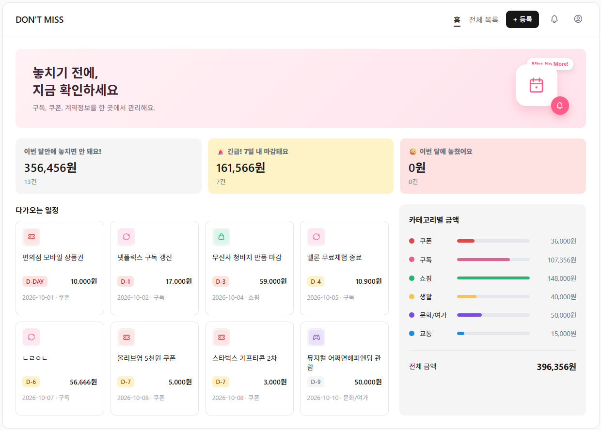
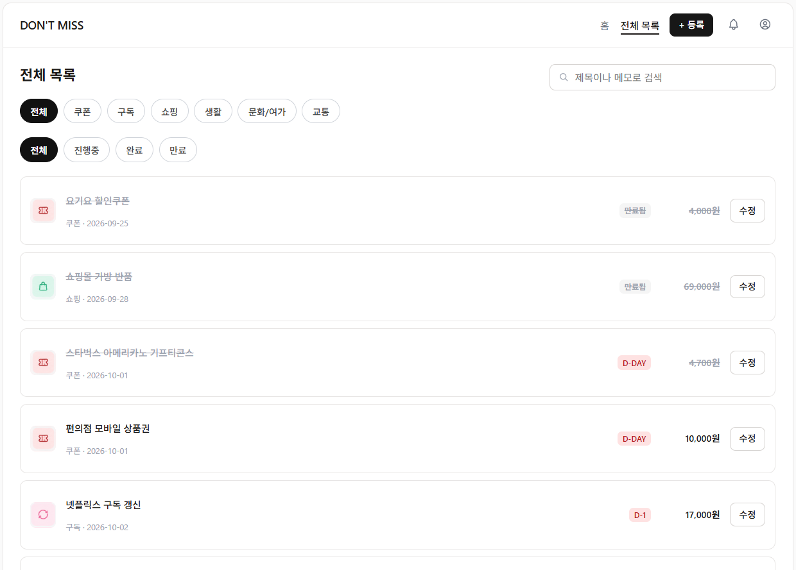
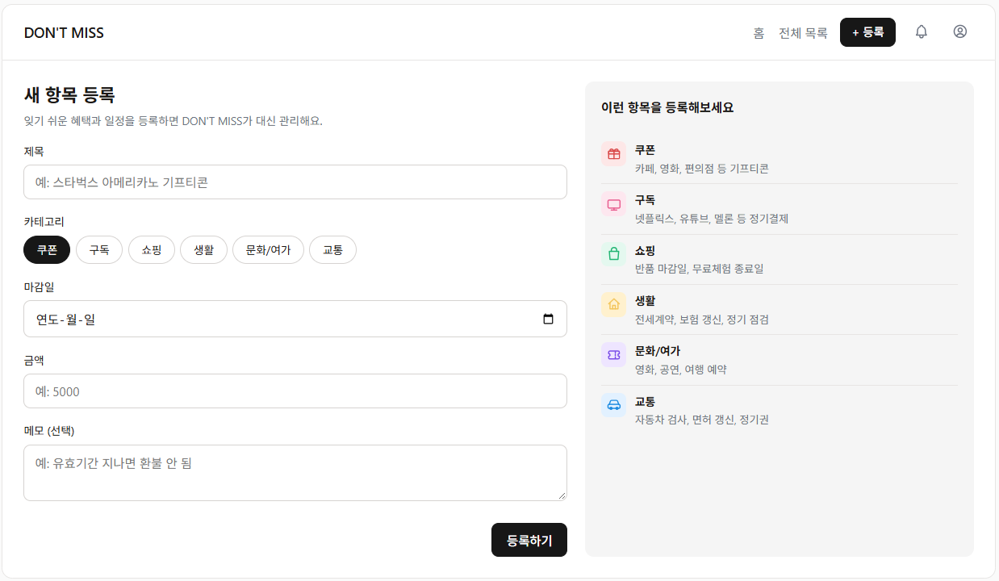
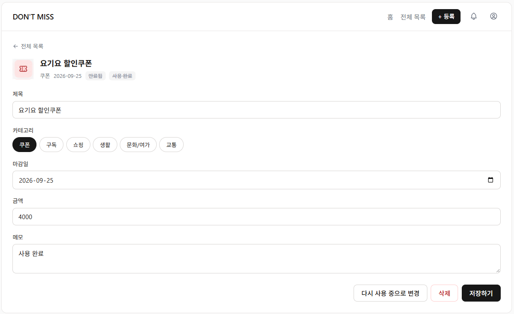

## 1. 프로젝트 소개

- 프로젝트 이름 : DON'T MISS
- 프로젝트 주제 : 놓치기 쉬운 혜택, 구독, 계약, 생활 일정을 한 곳에서 관리하는 서비스
- 제작 목적 : 항목별 D-Day·예상 손실 금액을 한눈에 확인하고, 불필요한 손실을 예방하기 위해 제작
- 주요 사용자 : 기프티콘·구독·반품 등 각종 기한을 놓쳐 금전적 손실을 경험하거나 관리에 불편함을 느끼는 사용자
- 개발 기간 : 2026.09.28 ~ 2026.10.01 (4일) (SeSAC 미니 프론트엔드 과제)

## 2. 주요 기능

#### 홈 대시보드 ( `/` )
- 이용중인 구독, 쿠폰, 생활 항목을 홈 대시보드에서 한번에 조회
- 일정기간내(이번달, 7일 내) 임박항목 확인
- 이번달 내에 놓쳐서 손해본 금액, 건수 확인
- 다가오는 일정: (마감일 빠른순)중 top 8개를 확인
- 카테고리별 금액: 현재 완료되지 않은 항목의 총 금액 확인 (놓치면 돈 나가는 금액)

```bash
: 완료되지 않은(아직 신경 써야 하는) 항목만 통계에 반영
: 월이 바뀌면 자동으로 정보가 업데이트됨
```

#### 전체 목록 ( `/items` )
- 카테고리(쿠폰, 구독 등)와 상태(진행중, 완료, 만료)로 필터링하여 조회
- 제목, 메모 내용으로 특정 항목 검색

#### 상세 확인 / 수정 (`/items/[id]`)
- 항목 옆의 수정버튼을 클릭하여 상세 내용 조회 및 수정/삭제 가능
- 상세 내용 조회시, 완료처리 / 다시 사용중으로 상태값 변경하여 사용현황 관리


#### 신규 등록 ( `/items/new` )
- 이름, 카테고리, 마감일, 금액, 메모를 입력해 새 항목 등록
- 필수값 미입력 시 에러 문구 표시


## 3. 화면 구성

화면 캡처는 `docs/` 폴더에 추가한 뒤 아래 경로에 맞게 연결해주세요.

### 홈 대시보드 (`/`)



30일 내 놓칠 금액, 7일 내 마감 건수, 이미 지난 항목 수와 다가오는 일정 8건, 카테고리별 금액 비중을 보여줍니다.

### 전체 목록 (`/items`)



카테고리 필터, 상태 필터(전체/진행중/완료/만료), 검색창을 통해 원하는 항목만 모아볼 수 있습니다.

### 등록 (`/items/new`)



이름, 카테고리, 마감일, 금액, 메모를 입력해 새 항목을 등록합니다.

### 상세·수정 (`/items/[id]`)



항목 정보를 수정하거나, 완료 처리/삭제, 완료 취소(다시 사용 중으로 변경)를 할 수 있습니다.

## 4. 기술 스택

- Next.js (App Router)
- React
- JavaScript
- JSON Server (Mock API)

> 기획 단계에서는 TanStack Query 사용을 검토했지만, 이번 프로젝트는 서버데이터를 반복적으로 불러오거나, 복잡하게 관리하지 않고, 화면이 한 번씩만 데이터를 조회·갱신하는 구조라 `useState + useEffect`로 직접 호출하는 방식을 택했습니다. 서버 요청에 사용하는 `fetch` 함수는 `api/items.js`에 분리하여 관리하고, 각 페이지에서는 필요한 API 함수를 호출해 데이터를 가져오도록 구성했습니다.


## 5. 설치 및 실행 방법

### 저장소 복제

```bash
git clone 저장소주소
```

### 프로젝트 폴더로 이동

```bash
cd dont-miss
```

### 패키지 설치

```bash
npm install
```

### JSON Server 실행

```bash
npm run server
```

### Next.js 실행

새로운 터미널을 열어 실행합니다.

```bash
npm run dev
```

### 접속 주소

- Next.js: http://localhost:3000
- JSON Server: http://localhost:4000

`package.json`에는 아래와 같이 스크립트가 등록되어 있어야 합니다.

```json
{
  "scripts": {
    "dev": "next dev",
    "server": "json-server --watch db.json --port 4000"
  }
}
```

## 6. 폴더 구조


```
public/
├─ category/             # 카테고리별 기본 이미지
└─ logo/                 # 브랜드 로고 이미지

src/
├─ api/                  # json-server 요청 함수
   └─ items.js              json-server 요청 함수 모음 (GET/POST/PATCH/DELETE)
├─ app/                  # 페이지와 라우팅
│  ├─ items/
│  │  ├─ [id]/page.js    # 상세·수정 (/items/[id])
│  │  ├─ new/page.js     # 신규 등록 (/items/new)
│  │  └─ page.js         # 전체 목록 (/items)
│  ├─ globals.css
│  ├─ layout.js
│  └─ page.js            # 홈 대시보드 (/)
├─ components/           # 재사용 UI 컴포넌트
│  ├─ Header.js
│  ├─ icons.js              공용 SVG 아이콘 모음
│  ├─ ItemCard.js           카드형 항목 (홈 화면용)
│  ├─ ItemForm.js           등록폼
│  └─ ItemRow.js            리스트형 항목 (전체 목록용)
└─ utils/                # 날짜·카테고리 계산 helper
   ├─ category.js           카테고리 값 ↔ 한글 라벨 매핑
   └─ dday.js               D-Day 계산 (날짜 파싱을 한 곳으로 통일)
```

## 7. 컴포넌트 설계

| 컴포넌트 | 역할 |
|---|---|
| `Header` | 상단 네비게이션(로고, 메뉴, 등록 버튼, 알림/계정 아이콘)을 표시합니다. 현재 경로에 따라 활성 메뉴를 강조합니다. |
| `ItemCard` | 항목 하나(아이콘, 제목, D-Day 뱃지, 금액, 카테고리)를 카드 형태로 표시합니다. 홈 화면의 "다가오는 일정"에서 재사용합니다. |
| `ItemRow` | `ItemCard`와 같은 정보를 한 줄짜리 리스트 행으로 보여주고, 줄마다 수정 버튼을 둡니다. 전체 목록 화면에서 씁니다. |
| `ItemForm` | 항목 등록에 필요한 입력값(제목/카테고리/마감일/금액/메모)을 받고, 필수값 검증 후 등록 요청을 보냅니다. |
| `icons.js` | 외부 아이콘 폰트 대신 쓰는 자체 SVG 아이콘 모음입니다. |

### 상태 관리

- 입력창 값과 카테고리 선택은 등록 폼(`ItemForm`) 내부에서 `useState`로 관리합니다. 해당 화면에서만 쓰이는 값이라 전역 상태로 둘 필요가 없습니다.
- 목록의 카테고리/상태 필터와 검색어는 `/items` 페이지 내부에서 `useState`로 관리합니다. 다른 화면과 공유하지 않는 UI 상태입니다.
- `items` 목록과 상세 데이터는 각 페이지에서 `useEffect`로 `api/items.js`의 함수를 호출해 가져오고, 등록·수정·삭제 후에는 응답으로 받은 최신 데이터로 화면 상태를 갱신합니다.
- D-Day 계산, 만료 여부 판단, 카테고리 라벨/아이콘 변환처럼 여러 화면에서 반복되는 로직은 `utils/dday.js`, `utils/category.js`로 분리해 중복을 없앴습니다.


## 8. 트러블슈팅

### 날짜 경계에서 D-Day가 하루씩 어긋나는 문제

#### 문제

마감일이 "정확히 7일 남음" 같은 경계값일 때 홈 화면의 "7일 내 마감" 건수와 "30일 내 놓칠 금액"에 포함되는 항목이 서로 다르게 계산되는 경우가 있었습니다.

#### 원인

`new Date("2026-10-15")`처럼 날짜 문자열만 넘기면 자바스크립트는 이를 UTC 자정으로 해석합니다. 반면 비교 대상인 오늘 날짜는 `setHours(0,0,0,0)`으로 한국 시간(UTC+9) 기준 자정으로 맞췄습니다. 같은 "자정"이라도 기준 시간대가 서로 달라, 계산하는 곳마다 `new Date(dueDate)`를 쓰는지 `new Date(\`${dueDate}T00:00:00\`)`를 쓰는지가 섞여 있어서 경계일에 하루 오차가 생겼습니다.

#### 해결

날짜 문자열을 Date로 바꾸는 부분을 `utils/dday.js`의 `parseLocalDate()` 함수 하나로 모으고, D-Day 계산이 필요한 모든 곳(`getDdayNumber`, `isExpired` 등)이 이 함수만 거치도록 통일했습니다.

#### 알게 된 점

같은 날짜 문자열이라도 Date로 변환하는 방식에 따라 기준 시간대가 달라질 수 있다는 것을 알게 되었습니다. 날짜 비교처럼 여러 곳에서 반복되는 계산은 처음부터 유틸 함수로 묶어두어야 이런 불일치를 막을 수 있다는 것도 배웠습니다.


## 프로젝트 회고

놓치기 쉬운 쿠폰·구독·일정을 한 곳에서 관리한다는 주제를 직접 기획하고 화면 구성부터 데이터 구조까지 설계하면서, 어떤 정보를 어떤 화면에 보여줘야 사용자에게 실제로 도움이 되는지 고민해볼 수 있었습니다. 특히 대시보드에 카테고리별 "개수" 대신 "금액"을 보여주기로 바꾼 과정에서, 숫자를 단순히 나열하는 것과 서비스의 핵심 가치(돈을 잃지 않는 것)에 맞는 지표를 고르는 것은 다른 문제라는 것을 느꼈습니다.

구현 과정에서는 날짜 비교처럼 사소해 보이는 부분에서 예상치 못한 오차가 생기는 것을 직접 겪으며, 반복되는 로직을 유틸 함수로 분리하는 습관의 중요성을 다시 확인했습니다.

다음 프로젝트에서는 TanStack Query처럼 서버 상태 관리 도구가 실제로 필요한 규모의 데이터와 화면 흐름을 설계해 직접 적용해보고 싶고, 기획서에 적었던 이메일/영수증 인식 기반 자동 등록 같은 확장 기능도 사용자 승인 절차를 포함해 설계해보고 싶습니다.